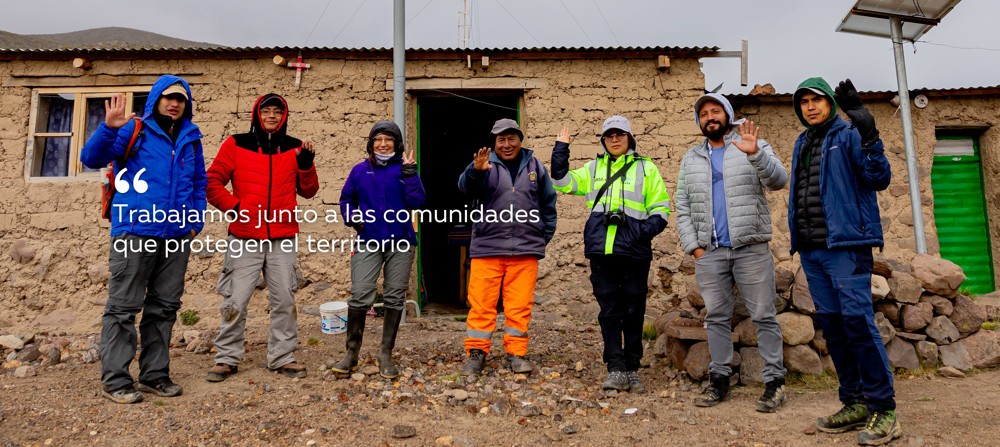
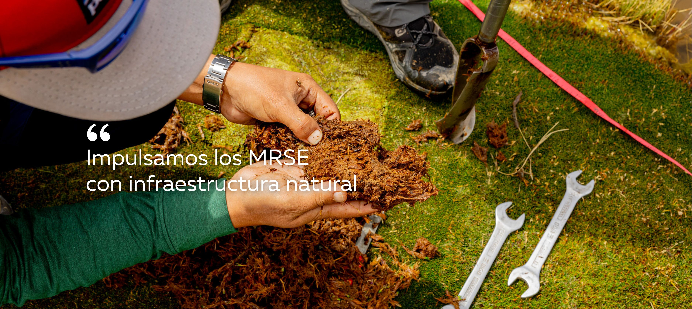
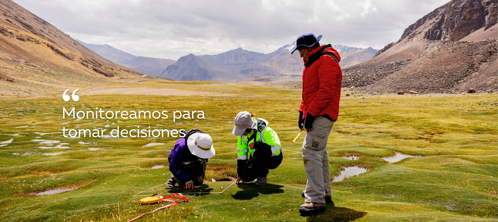
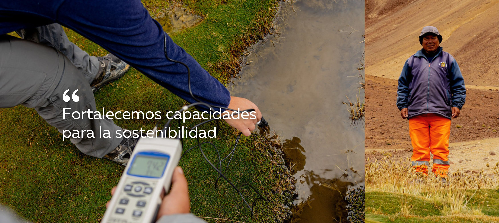
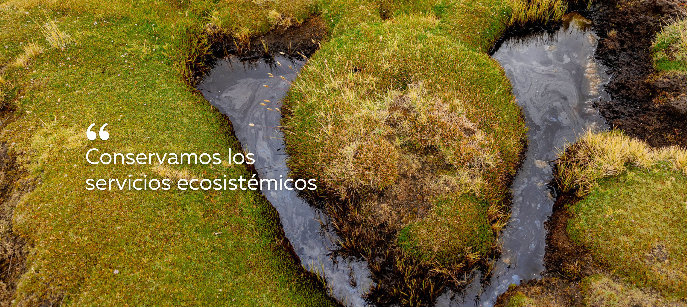
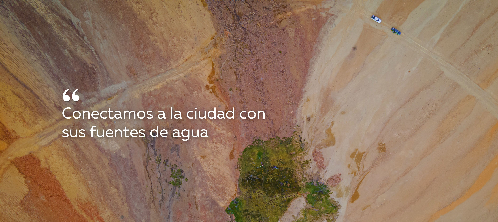
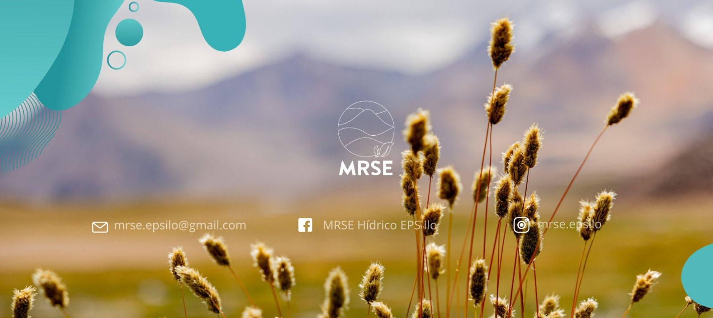

<!-- quarto publish gh-pages -->

## Column {width="25%"}

**¡Bienvenida/o a la Plataforma Web del MRSE!💧**

**EPS Ilo** impulsa la implementación de los MRSEH. Aquí podrás:

[**📰**](https://mrse-epsilo.github.io/AGUAILO/noticias.html)Conocer las últimas [**noticias**](https://mrse-epsilo.github.io/AGUAILO/noticias.html) y avances del MRSE

[**💧**](https://mrse-epsilo.github.io/AGUAILO/monitoreo_beta.html)Acceder y descargar datos actualizados de [**monitoreo**](https://mrse-epsilo.github.io/AGUAILO/monitoreo_beta.html)

🔎Siguenos en:

📸 [**Instagram**](https://www.instagram.com/mrse.epsilo?igsh=MXJ5ZTR0ZGgydTk1NA==) 💬 [**Facebook**](https://web.facebook.com/profile.php?id=61568465323222) ▶️ [**Youtube**](https://www.youtube.com/@MRSEHidricoEPSILOS.A.)



## Column {width="75%"}

#### Imágenes destacadas

::: contenedor-imagen
      
:::

```{=html}
<style>
/* Estilos para el contenedor de la transición */

.contenedor-imagen {
    width: 100%;
    height: 620px;
    position: relative;
    overflow: hidden;
    }

/* Estilos para las imágenes */
.contenedor-imagen img {
    width: 100%;
    height: auto;
    position: 
    absolute;
    top: 0;
    left: 0;
    opacity: 0;
    transition: opacity 1s ease-in-out;
    }

/* Estilo para mostrar la primera imagen */
.contenedor-imagen img:first-child {
    opacity: 1;
    }

 /* Estilo para las imágenes anteriores */
 .image-previous {
    opacity: 0.5;
    left: -100%;
    }

</style>

<script>
var currentImage = 0;
var images = document.querySelectorAll('.contenedor-imagen img');
var anteriorboton = document.getElementById('anterior');
var siguienteboton = document.getElementById('siguiente');

// Función para avanzar a la siguiente imagen
function avanzar() {
  images[currentImage].classList.add('image-previous');
  images[currentImage].style.opacity = 5;
  currentImage = (currentImage + 1) % images.length;
  images[currentImage].style.opacity = 1;
  images[currentImage].classList.remove('image-previous');
}

// Función para retroceder a la imagen anterior
function retroceder() {
  images[currentImage].classList.add('image-previous');
  images[currentImage].style.opacity = 0;
  currentImage = (currentImage - 1 + images.length) % images.length;
  images[currentImage].style.opacity = 1;
  images[currentImage].classList.remove('image-previous');
}

// Cambia la imagen automáticamente cada 7 segundos
setInterval(avanzar, 7000);

</script>
```
> FOTOGRAFIAS DESTACADAS DEL MRSE DE LA EPS ILO
