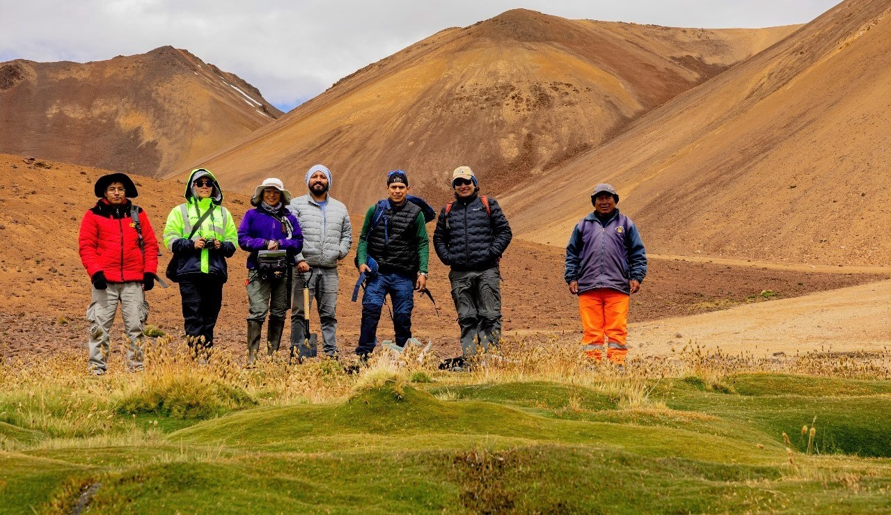
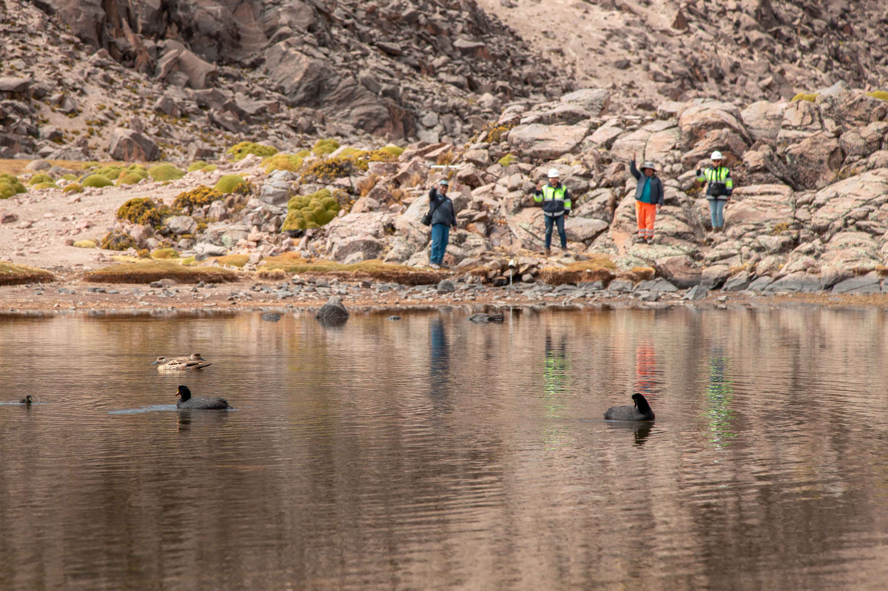
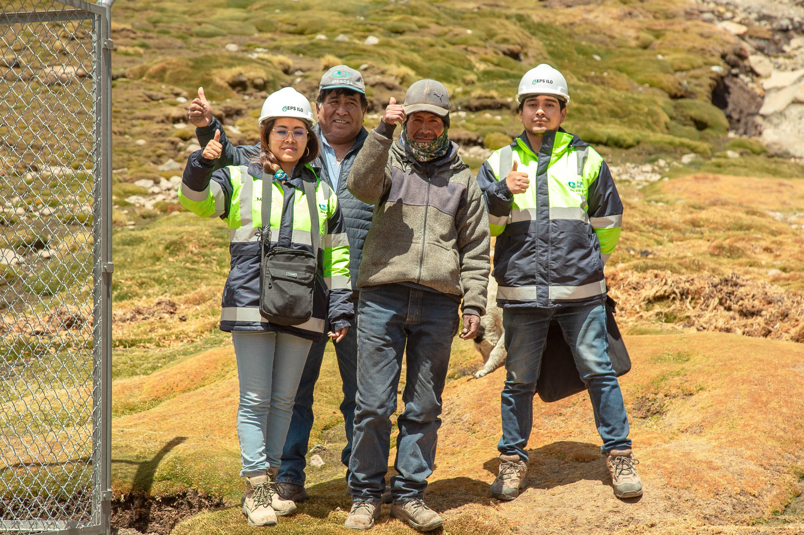

```{r setup, include=FALSE}
library(flexdashboard)
library(highcharter)
library(tidyverse)
library(plotly)
library(ggthemes)
library(lubridate)
library(vembedr)
library(leaflet)
library(sf)
library(openair)
```


Presentación {data-icon="fa-droplet"}
===

Column {data-width=200}
---
<center>


{width="85%"}

</center>

### <span style="color:darkblue;font-weight:bold;">Bienvenida a esta plataforma de acceso público</span>

***MRSE-H de la EPS Ilo S.A.***

> EPS Ilo S.A. realiza implementación del Plan de Intervención los MRSE en la Comunidad Campesina de Asana con la finalidad de conservación y recuperación de los Servicios Ecosistémicos Hídricos.

***Equipo MRSE***
<br><br>
<center>

```{r}
embed_youtube("FqETSuNF4ks", height = 215, width = NULL,allowfullscreen = TRUE)
```
</center>

Column {.tabset data-width="500" .tabset-fade}
---

### <span style="color:darkblue;font-weight:bold;">NOSOTROS</span>

<div class="contenedor-imagen">
  
  
  
</div>

<!-- Agrega botones para avanzar y retroceder -->
<button id="anterior">Anterior</button>
<button id="siguiente">Siguiente</button>

```{css}
        /* Estilos para el contenedor de la transición */
        .contenedor-imagen {
            width: 100%;
            height: 620px;
            position: relative;
            overflow: hidden;
        }

        /* Estilos para las imágenes */
        .contenedor-imagen img {
            width: 100%;
            height: auto;
            position: absolute;
            top: 0;
            left: 0;
            opacity: 0;
            transition: opacity 1s ease-in-out;
        }

        /* Estilo para mostrar la primera imagen */
        .contenedor-imagen img:first-child {
            opacity: 1;
        }

        /* Estilo para las imágenes anteriores */
        .image-previous {
            opacity: 0.5;
            left: -100%;
        }

        /* Estilos para los botones */
        button {
    margin: 0;
    padding: 10px 20px; /* Aumentamos el padding para un aspecto más moderno */
    font-size: 16px;
    cursor: pointer;
    position: absolute;
    top: 10px;
    background-color: rgba(0, 0, 0, 0.5); /* Fondo con transparencia */
    color: #fff; /* Color de texto blanco */
    border: none;
    border-radius: 5px; /* Bordes redondeados */
    transition: background-color 0.3s, color 0.3s; /* Efecto de transición */
    outline: none; /* Quitamos el borde al hacer clic */
}

button:hover {
    background-color: rgba(0, 0, 0, 0.8); /* Cambio de color al pasar el mouse */
}

        #anterior {
            left: 10px; /* Ajusta la posición horizontal del botón "Anterior" */
        }

        #siguiente {
            right: 10px; /* Ajusta la posición horizontal del botón "Siguiente" */
        }
```


```{js}
var currentImage = 0;
var images = document.querySelectorAll('.contenedor-imagen img');
var anteriorButton = document.getElementById('anterior');
var siguienteButton = document.getElementById('siguiente');

// Función para avanzar a la siguiente imagen
function avanzar() {
  images[currentImage].classList.add('image-previous');
  images[currentImage].style.opacity = 0;
  currentImage = (currentImage + 1) % images.length;
  images[currentImage].style.opacity = 1;
  images[currentImage].classList.remove('image-previous');
}

// Función para retroceder a la imagen anterior
function retroceder() {
  images[currentImage].classList.add('image-previous');
  images[currentImage].style.opacity = 0;
  currentImage = (currentImage - 1 + images.length) % images.length;
  images[currentImage].style.opacity = 1;
  images[currentImage].classList.remove('image-previous');
}

// Manejadores de clic para los botones
anteriorButton.addEventListener('click', retroceder);
siguienteButton.addEventListener('click', avanzar);

// Cambia la imagen automáticamente cada 6 segundos
setInterval(avanzar, 6000);
```


Precipitación {data-icon="fa-chart-simple"}
===

## Column {data-width="600"}


```{r}
# Carga de la base de datos:
df <- read.csv("data_marzo")

df$date <- as.POSIXct(
  paste(df$date, df$hora, sep = " "),
  format = "%Y-%m-%d %H:%M")

df$hora <- NULL

# Últimos datos descargados:
descargado <- read.csv("n5.csv", skip = 1)[-1]
names(descargado) <- c("date", "pp")
descargado$date <- as.POSIXct(
  descargado$date, format = "%y/%m/%d %H:%M")

# Unión de datasets
df2 <- rbind(df, descargado)
```

<!-- Conversión a data diaria: -->

```{r}
df3 <- df2 %>% 
  mutate(date0 = as.Date(date, format = "%Y-%m-%d"),
         date1 = format(date, format = "%Y-%m"),
         date2 = format(date, format = "%d")) %>% 
  reframe(pp = sum(pp, na.rm = T), .by = c(date1,date2))
```

### <span style="color:darkblue;font-weight:bold;">DATOS CRUDOS (DESCARGA)</span>

```{r}
data <- df2
names(data) <- c("fecha", "Precipitacion")
data$fecha <- as.numeric(data$fecha)*1000-(5*3600*1000)

highchart(type = "stock") %>%
  hc_title(text = "Estación Asana (Datos crudos)") %>%
  hc_xAxis(type = "datetime") %>%
  hc_add_series(data = data, type = "column",
                hcaes(x = fecha, y = Precipitacion),
                name = "Precipitacion", color = "#3182BD") %>%
  hc_exporting(
    enabled = TRUE,
    buttons = list(
      contextButton = list(
        menuItems = c("downloadPNG",
                      "downloadPDF",
                      "separator",
                      "downloadCSV",
                      "downloadXLS",
                      "separator",
                      "resetZoom")
      )
    )
  ) %>% 
  hc_xAxis(type = "datetime", showLastLabel = TRUE,
           dateTimeLabelFormats = list(month = "%B")) %>% 
  hc_tooltip(shared = TRUE, useHTML = TRUE) %>% 
  hc_chart(zoomType = "x")
```

### <span style="color:darkblue;font-weight:bold;">MESES COLECTADOS</span>

```{r}
cantidad <- sum(length(unique(df3$date1)))
gauge(paste0(cantidad, "meses"), min = 0, max = 12, gaugeSectors(
  danger = c(0, 2), warning = c(3, 5), success = c(6, 10)
))
```

## Column {data-width="600"}

### <span style="color:darkblue;font-weight:bold;">GRÁFICO DE BARRAS</span>

```{r}
df4 <- df3
names(df4) <- c("fecha1","fecha3", "Precipitacion")
m2 <- df4 %>% ggplot(aes(x=factor(fecha3),y=Precipitacion))+
  geom_bar(stat="identity",fill="turquoise", position = )+
  labs(x="Fecha",y="Precipitación (mm)") + 
  theme_minimal() + theme(plot.title = element_text(size = 14,
    face = "bold", hjust = 0.5),
    plot.subtitle = element_text(size = 12,
    face = "italic", hjust = 0.5),
    legend.position = "none",
    strip.text.x = element_text(colour = "white",face = "bold",
                                family = "helvetica"),
    strip.background = element_rect(
     color="#3182BD", fill="#3182BD",
     size=1.5, linetype="solid"),
    axis.title = element_text(size = 5),
    axis.text.x = element_text(size = 5,
        angle = 90)) +
  facet_wrap(~fecha1,ncol=2)
ggplotly(p=m2)
```

## Column {data-width="200"}

### Precipitación acumulada
```{r}
valueBox(paste0(sum(df2$pp, na.rm=T)," milímetros"), icon = "fa-droplet")
```

### Inicio de registro

```{r}
valueBox(min(df2$date, na.rm=T), icon = "fa-pencil")
```

### Último registro

```{r}
valueBox(max(df2$date, na.rm=T), icon = "fa-pencil")
```

### <a href="https://felt.com/map/MRSE-H-YL2D8IAiQoucf0SETYCFBC?loc=-17.04095,-70.48828,12.2z" style="color: darkblue; font-weight: bold; text-decoration: none;">MAPA WEB (Clic aquí para ser dirigido a un mapa más detallado)</a>


```{r}
library(leaflet)
leaflet() %>% 
  addTiles() %>%
  addMarkers(lat=-17.062286,lng=-70.520806,
             popup = paste(sep="<br>","<b>Lugar:</b>","Estación pluviométrica","<b>Latitud:</b>","-17.062286","<b>Longitud:</b>"
                           ,"-70.520806")) %>% 
  addCircleMarkers(lat=c(-17.062286,-17.630402),
                   lng=c(-70.520806,-71.335089), radius = 40,
                   color="deepskyblue") %>% 
  addMarkers(lat=-17.630402,lng=-71.335089,
             popup = paste(sep="<br>","<b>Lugar:</b>","EPS ILO S.A.","<b>Latitud:</b>","-17.630402","<b>Longitud:</b>",
                           "-71.19908"))
```

Datos futuros {data-icon="fa-chart-simple"}
===

## Column {.tabset data-width="600"}

### <span style="color:darkblue;font-weight:bold;">GRÁFICO DE DATOS DIARIOS</span>

```{r}
data <- read.csv("simulados.csv")
data$fecha_hora <- as.POSIXct(
  data$fecha_hora,format="%Y-%m-%d %H:%M")

pp <- data %>% mutate(
  fecha_hora = as.Date(
    fecha_hora, format = "%Y-%m-%d")) %>% 
  group_by(fecha_hora) %>% 
  summarise(precipitacion = sum(precipitacion, na.rm = T)) %>% 
  select(fecha_hora, precipitacion)

s <- data %>% mutate(
  fecha_hora = as.Date(
    fecha_hora, format = "%Y-%m-%d")) %>% 
  group_by(fecha_hora) %>% 
  summarise_if(is.numeric,.funs = mean)

s$precipitacion <- pp$precipitacion

highchart() %>%
  hc_title(text = "Estación Asana (Datos diarios)") %>%
  hc_xAxis(type = "datetime") %>%
  hc_add_series(data = s, type = "line",
                hcaes(x = fecha_hora, y = precipitacion),
                name = "Precipitacion", color = "#3182BD") %>%
  hc_add_series(data = s, type = "line",
                hcaes(x = fecha_hora, y = temperatura),
                name = "Temperatura", color = "hotpink") %>%
  hc_add_series(data = s, type = "line",
                hcaes(x = fecha_hora, y = humedad),
                name = "Humedad", color = "turquoise") %>%
  hc_exporting(
    enabled = TRUE,
    buttons = list(
      contextButton = list(
        menuItems = c("downloadPNG",
                      "downloadPDF",
                      "downloadCSV",
                      "downloadXLS")
      )
    )
  ) %>% 
  hc_xAxis(type = "datetime", showLastLabel = TRUE,
           dateTimeLabelFormats = list(month = "%B")) %>% 
  hc_tooltip(shared = TRUE, useHTML = TRUE) %>% 
  hc_chart(zoomType = "x")
```

### <span style="color:darkblue;font-weight:bold;">ROSA DE VIENTOS</span>

```{r}
windRose(mydata,paddle = F,type = "season", hemisphere = "southern")
```

### <span style="color:darkblue;font-weight:bold;">DIAPOSITIVAS</span>

```{r}
xaringanExtra::embed_xaringan("m2/pres.html")
```

## Column {data-width="150"}

### Precipitación acumulada

```{r}
valueBox(paste0(sum(s$precipitacion, na.rm=T)," milímetros"), icon = "fa-droplet")
```

### Radiación solar

```{r}
valueBox(paste0(round(mean(s$radiacion_solar, na.rm=T),2)," W/m2"), icon = "fa-sun", color = "yellow")
```

### Humedad relativa

```{r}
valueBox(paste0(round(mean(s$humedad, na.rm=T),2)," %"), icon = "fa-wind",
         color = "turquoise")
```

### Temperatura media

```{r}
valueBox(paste0(round(mean(s$temperatura, na.rm=T),2)," °C"), 
         icon = "fa-temperature-three-quarters",color = "hotpink")
```

Noticias {.storyboard data-icon="fa-newspaper"}
===
  
### EL INICIO DE LA IMPLEMENTACIÓN


### SUPERVISIÓN DE ZANJAS DE INFILTRACIÓN


### VERIFICACIÓN DE INSTALACIÓN DE PLUVIÓMETRO


### PARTICIPACIÓN EN PLATAFORMA DE BUENA GOBERNANZA


### APROBACIÓN DEL ACUERDO MERESE ANTE EL MINAM


<!-- ### FORO SOBRE MERESE HÍDRICOS EN MOQUEGUA: UN DIÁLOGO ENRIQUECEDOR ENTRE EXPERTOS Y COMUNIDAD -->

<!--  -->

<!-- *** -->

<!-- **3 de agosto del 2023,** se participó conjuntamente con otros líderes y especialistas en un evento organizado por SUNASS, Forest Trends, UNAM y Southern Perú. A fin de dar a conocer y compartir experiencias con los participantes el equipo MRSE-H de la EPS Ilo S.A. participó en calidad de panelista, ponente y dando información en un módulo educativo. -->


<!-- ### EPS ILO REALIZÓ PASANTÍA PARA FORTALECER CAPACIDADES SOBRE LOS MRSE - H -->

<!--  -->

<!-- *** -->

<!-- **18 de setiembre del 2023,** EPS Ilo S.A. participó en pasantía a SEDAPAR los dias 4, 5 y 6 de setiembre fin de conocer el trabajo que se viene realizando en su MRSE-H y el tipo de sistema de tratamiento de agua. Los conocimientos y consejos adquiridos servirán para mejorar en el trabajo que se viene realizando. -->

<!-- ### EPS ILO PARTICIPÓ EN LA FERIA CIENTÍFICO-TECNOLÓGICA DEL AGUA Y SOSTENIBILIDAD AMBIENTAL "EXPO AGUA 2023" -->

<!--  -->

<!-- *** -->

<!-- **17 de octubre,** EPS ILO S.A. fue parte de las actividades del Expo Agua 2023, la novena edición de un evento nacional que busca el encuentro de soluciones tecnológicas, científicas y de servicios para lograr reducir las brechas existentes en términos de sostenibilidad del pais. -->


<!-- ### EPS ILO S.A. REALIZÓ EL WEBINAR "UNA PÁGINA PARA EL MRSE" -->

<!--  -->

<!-- *** -->

<!-- **25 de octubre,** como parte de los planes del MRSE-H de la EPS ILO S.A. se realizó el lanzamiento virtual (webinar) titulado "Una página para el MRSE" un espacio que buscó dar a conocer las bondades de que un MRSE-H posea una página web para ordenar, procesar y dar a conocer sus datos de monitoreo hidrológico al público en general. -->

<!-- ### EPS ILO S.A. PARTICIPÓ en el Encuentro Nacional de Merese Hidrico: PERÚ MERESE -->

<!--  -->

<!-- *** -->

<!-- **20 de octubre,** EPS Ilo S.A. Participó en el Encuentro Nacional de Merese Hidrico: PERÚ MERESE, evento organizado en la ciudad de Arequipa que tuvo una duración del 18 al 20 de octubre, se contó con la participación de muchos actores relacionados al cambio climático y sostenibilidad hídrica. En esta oportunidad el MRSE-H de la EPS Ilo S.A. dió a conocer los logros y retos que se presentan en su área de intervención a fin de que otros puedan aprender de esta experiencia. -->
