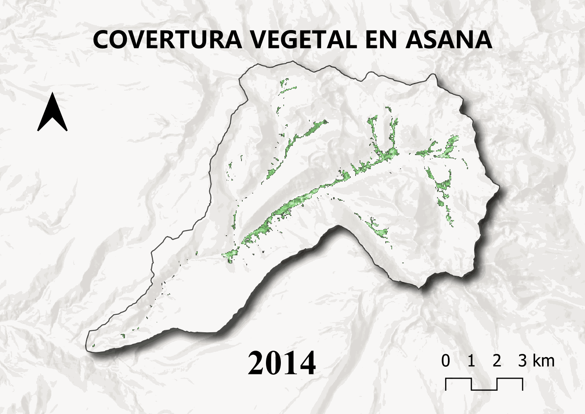

```{r}
#| include: false
library(highcharter)
library(tidyverse)
library(openxlsx)
```

# Histórico {.tabset width="100%"}
## xddd
```{r}
#| title: "Estación 01"
source("Scripts/Estacion1.R")
estacion1("datasets/ASA_01_PO_01")
```


```{r}
#| title: "Estación 02"
source("Scripts/Estacion2.R")
qocha(carpeta = "datasets/ASA_01_PO_02")
```

## xddd

```{r}
#| title: "Estación 03"
source("Scripts/Estacion3.R")
pesaje(carpeta = "datasets/ASA_01_PO_03")
```

```{r}
#| title: "Estaciones hidrométricas"

df <- read.csv("datasets/ASA_02_SO/PROCESADO_ASA_01_SO_14_10_25.csv", skip = 2, header = F) %>%
  select(2,6) %>% mutate(V2 = as.POSIXct(V2, format = "%m/%d/%y %I:%M:%S %p", tz = "UTC"))
names(df) <- c("date", "hidrometria_punto1")

df2 <- df %>%
    mutate(dia = as.Date(date, format = "%Y-%m-%d")) %>%
    summarise(hidrometria_punto1 = mean(hidrometria_punto1, na.rm = T), .by = dia)

df2 <- df2 %>%
    hchart(., type = "column", 
           hcaes(x = dia, 
                 y = hidrometria_punto1), color = "#154c79", name = "Altura") %>% 
    hc_title(
      text = "<b>Estación 01</b> - Precipitación diaria (mm)",
      margin = 20,
      align = "left",
      style = list(color = "#154c79", useHTML = TRUE)) %>% 
    hc_exporting(
      enabled = TRUE,
      buttons = list(
        contextButton = list(
          menuItems = c("downloadPNG",
                        "downloadCSV",
                        "downloadXLS",
                        "downloadPDF"))))
  
  df2
```

# Mapas {.tabset width="100%"}
## xdd
```{r}
#| title: NDVI
#| warning: false
#| message: false
#| echo: false

```

## xddd

```{r}
#| title: Mapa web del MRSE
#| echo: false
library(leaflet)
leaflet() %>%
  addTiles() %>%
  addMarkers(lat=-17.062286,lng=-70.520806,
             popup = paste(sep="<br>","<b>Lugar:</b>","Estación pluviométrica","<b>Latitud:</b>","-17.062286","<b>Longitud:</b>"
                           ,"-70.520806")) %>%
  addCircleMarkers(lat=c(-17.062286,-17.630402),
                   lng=c(-70.520806,-71.335089), radius = 40,
                   color="deepskyblue") %>%
  addMarkers(lat=-17.630402,lng=-71.335089,
             popup = paste(sep="<br>","<b>Lugar:</b>","EPS ILO S.A.","<b>Latitud:</b>","-17.630402","<b>Longitud:</b>",
                           "-71.19908"))
```