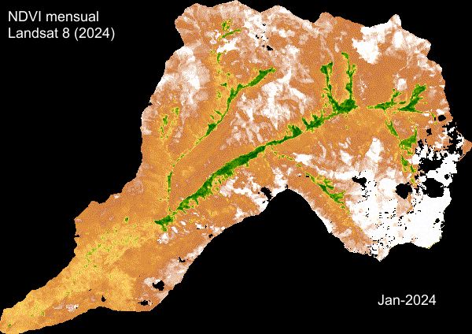

```{r setup, include = FALSE}
library(highcharter)
library(tidyverse)
library(openxlsx)
library(readxl)
library(leaflet)
library(sf)
```

# Descripción {.tabset width="100%"}
## xddd {width="35%"}

<b> Sobre los datos meteorológicos </b><br>

En este espacio se presentan datos metereológicos de la microcuenca Asana en el marco de los Mecanismos de
Retribución por Servicios Ecosistémicos – MRSE en el distrito de Torata, Moquegua – Empresa Prestadora de
Servicios de Saneamiento Ilo S.A. – EPS ILO S.A.

Se presentan cuatro estaciones de medición cuyos parámetros pueden apreciarse en los siguentes enlaces:

* <a href="javascript:void(window.open('metadatos/ASA_01_PO_01.pdf','','width=800,height=600').onunload = function(){window.history.back();})">
    Estación ASA_01_PO_01
  </a>: Genera datos de precipitación.
* <a href="javascript:void(window.open('metadatos/ASA_01_PO_02.pdf','','width=800,height=600').onunload = function(){window.history.back();})">
    Estación ASA_01_PO_02
  </a>: Genera datos de precipitación y temperatura.
* <a href="javascript:void(window.open('metadatos/ASA_01_PP_03.pdf','','width=800,height=600').onunload = function(){window.history.back();})">
    Estación ASA_01_PP_03
  </a>: Genera datos de precipitación y temperatura.
* <a href="javascript:void(window.open('metadatos/ASA_02_SO.pdf','','width=800,height=600').onunload = function(){window.history.back();})">
    Estación ASA_02_SO
  </a>: Genera datos del nivel del agua en un bofedal.


Así también, los datos de la estación **ASA_01_PO_01** se encuentran en la plataforma de 
<a href="https://www.datosabiertos.gob.pe/dataset/datos-metereol%C3%B3gicos-de-la-microcuenca-asana-en-el-marco-de-los-mecanismos-de-retribuci%C3%B3n" target="_blank" rel="noopener noreferrer">Datos abiertos</a>.

## Column {.tabset width="65%"}

```{r}
#| title: "Mapa Web"
library(leaflet)
library(sf)

# 1. Asegúrate de que tu objeto 'asana' esté cargado
asana <- st_read("vectores/asana.gpkg", quiet = TRUE)
monitoreo <- st_read("vectores/puntos2.gpkg", quiet = TRUE)
# 2. Crea el mapa base y añade tu capa vectorial
# Definir los nombres de los mapas base
OSM <- "OpenStreetMap"
SATELLITE <- "Esri World Imagery"

leaflet() %>%
  # 1. Añadir el primer mapa base (OpenStreetMap)
  # Este se muestra por defecto
  addProviderTiles(
    providers$OpenStreetMap,
    group = OSM
  ) %>%
  # 2. Añadir el mapa satelital (Esri World Imagery)
  # Debe estar en un grupo diferente
  addProviderTiles(
    providers$Esri.WorldImagery,
    group = SATELLITE
  ) %>%
  # 3. Añadir la capa vectorial de polígonos (asana)
  addPolygons(
    data = asana,
    fillColor = "lightblue",
    fillOpacity = 0.5,
    color = "blue",
    weight = 1
  ) %>%
  # 4. Añadir los puntos de monitoreo
  addMarkers(
    data = monitoreo,
    label = ~as.character(Punto),
    labelOptions = labelOptions(
      noHide =  TRUE,
      direction = 'auto',
      textsize = "10px",
      style = list(
  "color" = "black", # Color del texto (opaco, si no usas RGBA)
  "background-color" = "rgba(255, 255, 255, 0.7)", # Fondo blanco con 70% de opacidad
  "border-radius" = "3px"
)
    )
  ) %>%
  # 5. Añadir el control de capas
  addLayersControl(
    # Base Groups son los mapas que se excluyen mutuamente (solo se puede ver uno a la vez)
    baseGroups = c(OSM, SATELLITE),
    # Overlay Groups son capas que se pueden activar/desactivar (como 'asana' y 'monitoreo', aunque aquí no los incluimos)
    options = layersControlOptions(collapsed = FALSE) # Para que el selector esté abierto por defecto
  )
```

```{r}
#| title: "NDVI"

```


# Gráficos

## GA

```{r}
#| title: "ASA_01_PO_01"
source("Scripts/Estacion1.R")
estacion1(carpeta = "datasets/ASA_01_PO_01")
```


```{r}
#| title: "ASA_01_PO_02"
source("Scripts/Estacion2.R")
qocha("datasets/ASA_01_PO_02")
```

## xddd

```{r}
#| title: "ASA_01_PP_03"
source("Scripts/Estacion3.R")
pesaje("datasets/ASA_01_PO_03")
```

```{r}
#| title: "Estación de nivel"
#source("Scripts/Estacion4.R")
#bofedal("datasets/ASA_02_SO")
```