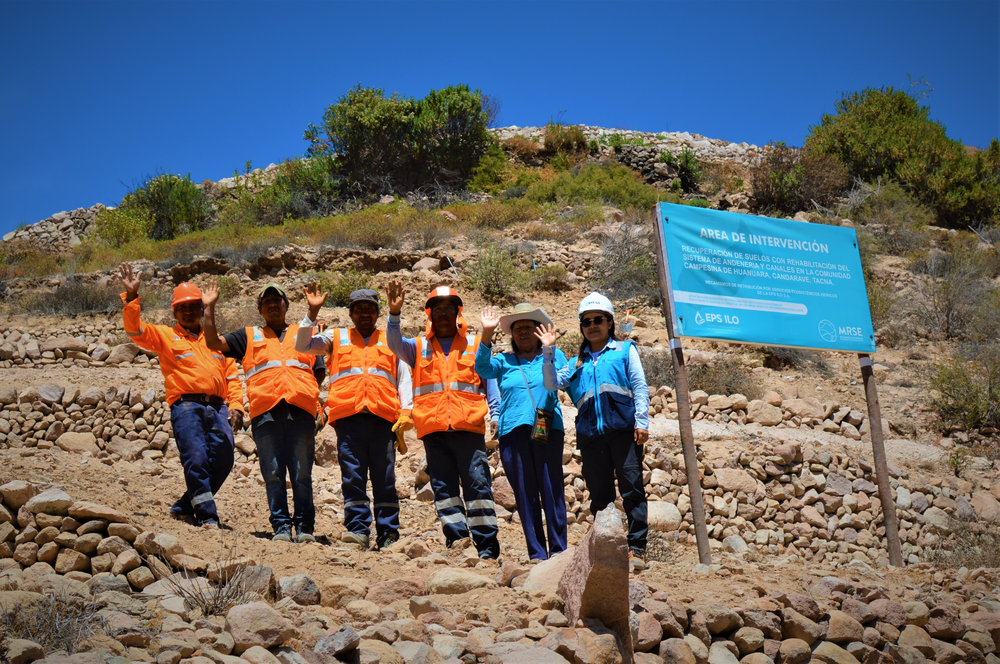

.onunload%20=%20function()%7Bwindow.history.back();%7D))

Como parte de la implementación de los Mecanismos de Retribución por Servicios Ecosistémicos Hídricos (MRSE-H), la EPS Ilo ha ejecutado una importante acción de recuperación de suelos en la Comunidad Campesina de Huanuara, Tacna.

La intervención consistió en la recuperación de 1.07 hectáreas de suelos degradados mediante la rehabilitación de andenes tradicionales, una técnica ancestral que contribuye a la infiltración del agua, la reducción de la escorrentía superficial y el control de la erosión.

Este tipo de acciones refuerza la función reguladora de los ecosistemas altoandinos, favoreciendo la recarga hídrica y asegurando la sostenibilidad del recurso en la parte baja de la cuenca.

La EPS Ilo reafirma su compromiso con la gestión integrada de los recursos hídricos, articulando esfuerzos con las comunidades locales para proteger las fuentes de agua desde su origen.

***#EPSIlo #MRSE #GestiónHídrica #ConservaciónDeSuelos #Andenería #RecargaHídrica #SeguridadHídrica #Ecosistemas #ApostamosPorLaConservación***
