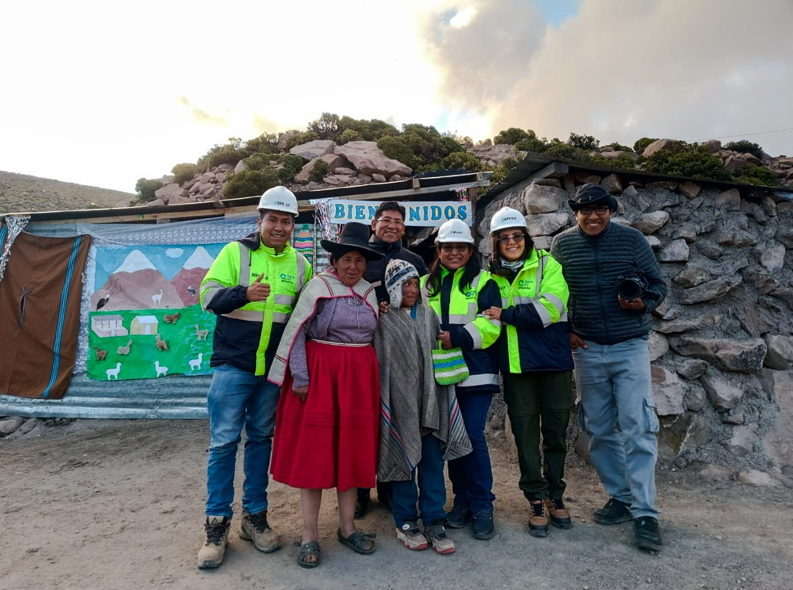

.onunload%20=%20function()%7Bwindow.history.back();%7D))

[💧🌱]{.underline}Desde la EPS Ilo, seguimos apostando por el cuidado de nuestras fuentes de agua y la sostenibilidad del territorio. A través los MRSEH, venimos ejecutando acciones concretas en la Comunidad Campesina de Asana para conservar y recuperar los ecosistemas que abastecen de agua a nuestra ciudad.

🚜🌿 ¿Qué estamos haciendo?

✅ Recuperación de pastizales y bofedales

✅ Cercado de ecosistemas para su protección

✅ Fortalecimiento de capacidades comunales en prácticas sostenibles

✅ Monitoreo hidrologico

✅ Alianzas con actores locales para una gestión hídrica compartida

🤝 Esta iniciativa no solo protege el agua que consumimos, sino que también fortalece a las comunidades altoandinas, reconociendo su rol clave como guardianes del agua.

¡El agua nace en las alturas y se cuida desde el origen!

***#EPSIlo #MRSEH #AguaQueUne #ServiciosEcosistémicos #AguaParaTodos #GestiónHídricaSostenible #ComunidadCampesinaDeAsana #ApostamosPorLaConversacion***
