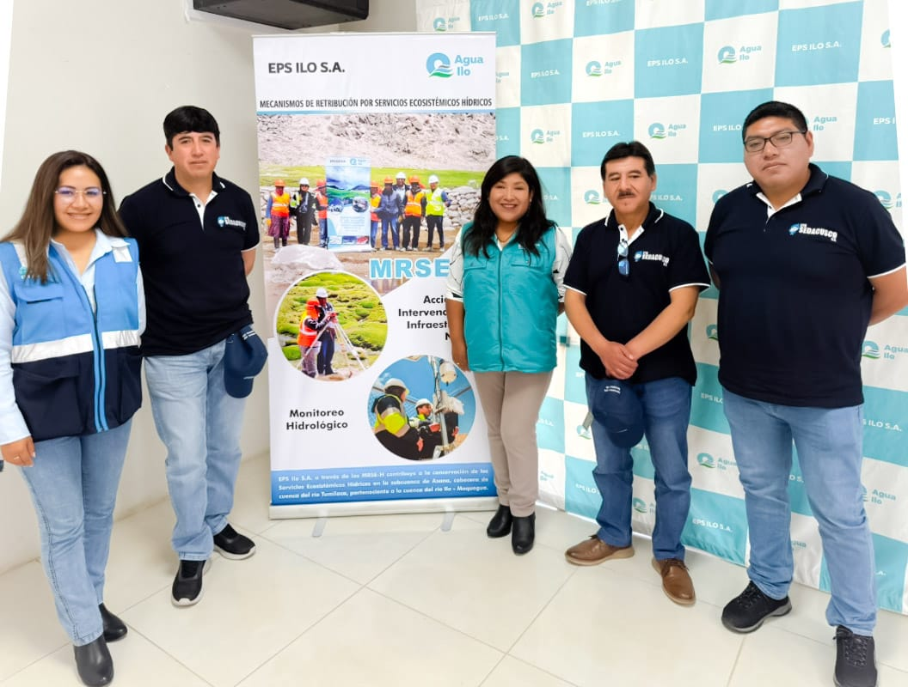

.onunload%20=%20function()%7Bwindow.history.back();%7D))

💧 **EPS ILO y SEDACUSCO fortalecen colaboración para una gestión hídrica sostenible**

En el marco de las buenas prácticas en gestión del agua, EPS ILO recibió la visita de una delegación técnica de SEDACUSCO para intercambiar experiencias sobre los Mecanismos de Retribución por Servicios Ecosistémicos Hídricos (MRSE-H) y el uso de sistemas de monitoreo hidrológico.

Durante el encuentro, se compartieron estrategias y herramientas implementadas por EPS Ilo para proteger las fuentes de agua, destacando el sistema de monitoreo como una herramienta clave para la toma de decisiones basadas en evidencia.

*"Compartir lo aprendido y conocer otras realidades es esencial para avanzar en una gestión hídrica eficiente y sostenible"*, señaló la Ing. Lizeth Condori Díaz, coordinadora de los MRSE de la EPS ILO.

La delegación de SEDACUSCO valoró la experiencia técnica del equipo MRSE-H de la EPS ILO y expresó su interés en aplicar estas buenas prácticas en su ámbito de intervención. Este intercambio marca el inicio de una colaboración continua entre ambas instituciones.

Por su parte, la gerente general de EPS Ilo, C.P.C. Solange del Pilar Agramonte Flores, destacó que alianzas como esta reafirman el compromiso del sector saneamiento con la innovación y sostenibilidad del recurso hídrico.

***#SostenibilidadHídrica #EPSIlo #SEDACUSCO***
