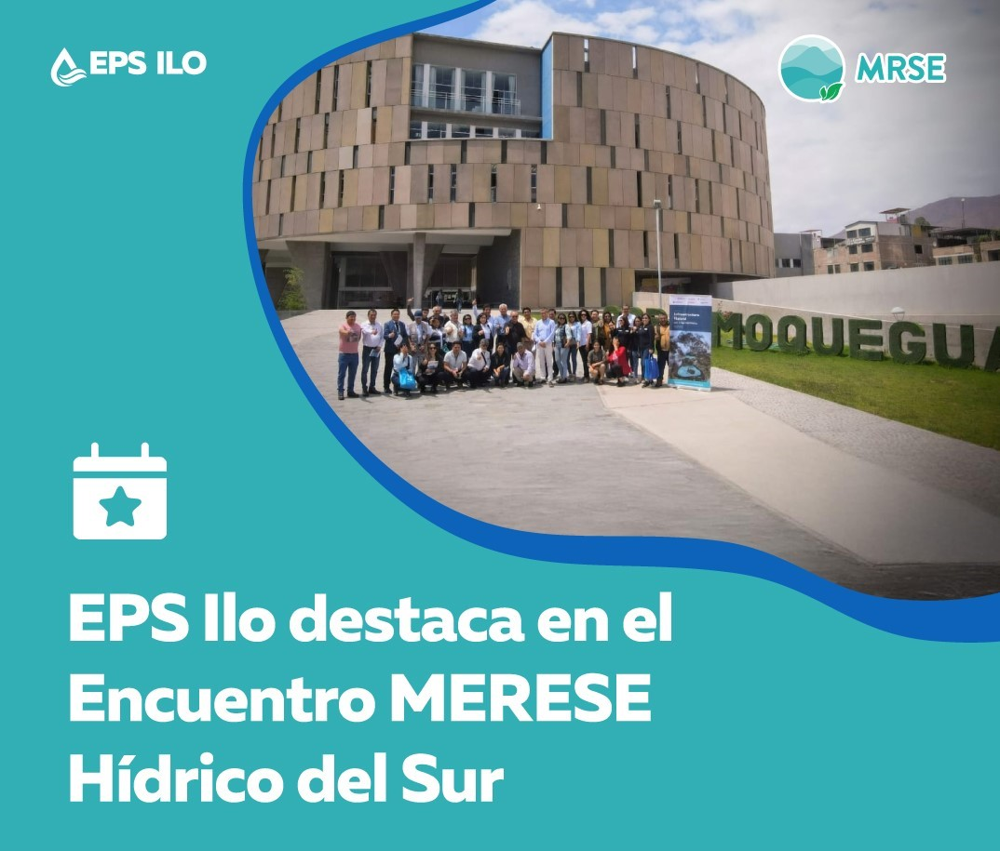

.onunload%20=%20function()%7Bwindow.history.back();%7D))

💧 **¡EPS Ilo reconocida por su liderazgo en MRSE Hídricos!**

EPS Ilo tuvo una destacada participación en el "Encuentro MERESE Hídrico de EPS del Sur", organizado por ANEPSSA Perú, Otass y EPSMoquegua, con el respaldo del proyecto NIWS (una iniciativa de USAID, el Gobierno de Canadá y Forest Trends).

Durante el evento, la Gerenta General, Solange del Pilar Agramonte Flores, recibió un merecido reconocimiento por el compromiso ejemplar de EPS Ilo con la implementación de los MRSE Hídricos. Este logro refleja el esfuerzo constante por promover una gestión hídrica sostenible, colaborativa e innovadora en beneficio de todos.

🌱 Bajo su liderazgo, EPS Ilo ha trabajado de la mano con las comunidades altoandinas en la conservación y recuperación de los servicios ecosistémicos hídricos, implementando acciones que fortalecen la resiliencia climática, fomentan el trabajo articulado y protegen nuestras fuentes de agua desde su origen.

¡Felicitaciones al equipo de EPS Ilo por marcar la diferencia y construir un futuro hídrico más sostenible para el sur del país!

***#EPSIlo #MRSEH #AguaQueUne #GestiónHídricaSostenible #Reconocimiento #NIWS #USAID #ForestTrends #GobiernoDeCanadá #ANEPSSA #Otass #EPSMoquegua #ServiciosEcosistémicos***

Lee más de esto en:

<https://inforegion.pe/presentan-avances-en-conservacion-hidrica-durante-encuentro-en-moquegua/>

<https://www.gob.pe/institucion/epsilo/noticias/1102030-eps-ilo-comparte-experiencias-exitosas-de-merese-hidrico-y-se-destaca-como-modelo-para-otras-eps>
