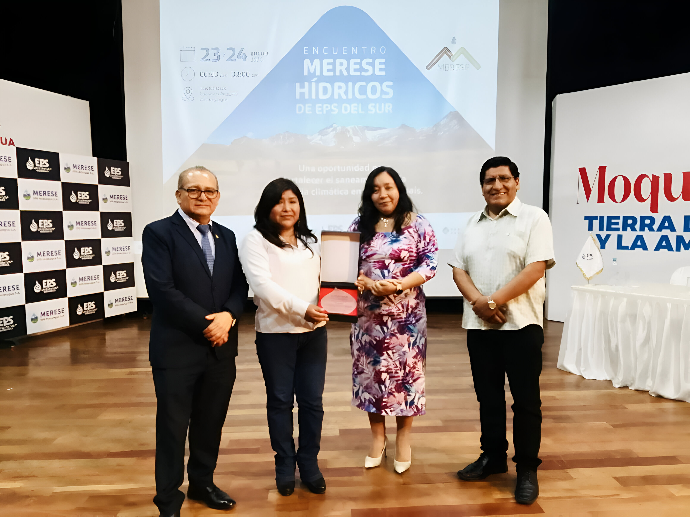

.onunload%20=%20function()%7Bwindow.history.back();%7D))

💧 **Encuentro MRSE Hídrico de EPS del Sur: Un paso firme hacia la sostenibilidad del agua**

El "Encuentro MERESE Hídrico de EPS del Sur" avanzó con éxito, consolidándose como un espacio clave para el intercambio de experiencias y conocimientos entre 16 EPS del Perú. 🙌

Organizado por ANEPSSA Perú, Otass y EPSMoquegua, con el respaldo del proyecto NIWS (impulsado por USAID, el Gobierno de Canadá y Forest Trends), el evento puso el foco en soluciones para una gestión hídrica sostenible en la región sur del país. 🌎

En este marco, EPS Ilo destacó por su liderazgo y compromiso ambiental, compartiendo sus experiencias junto a las comunidades campesinas de Asana y Huanuara. Entre las acciones presentadas se encuentran:

🛠 Construcción de qochas y zanjas de infiltración

🌿 Programas de capacitación en manejo sostenible de recursos

🤝 Trabajo articulado para la conservación de servicios ecosistémicos hídricos

Durante su ponencia, la Gerenta General, Solange del Pilar Agramonte Flores, remarcó cómo estas iniciativas promueven la resiliencia climática, el fortalecimiento comunitario y la colaboración interinstitucional, pilares esenciales para un futuro hídrico seguro y sostenible.

¡Cuidamos el agua desde su origen, con visión, compromiso y trabajo conjunto!
