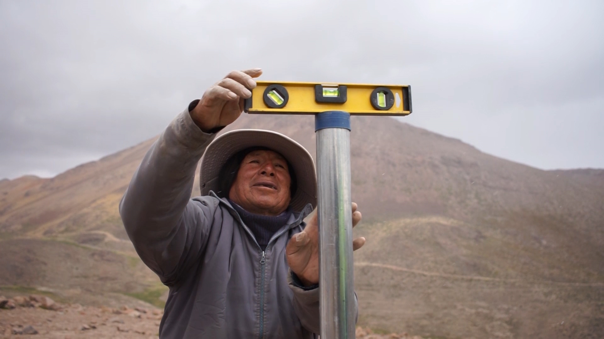

.onunload%20=%20function()%7Bwindow.history.back();%7D))

### EPS Ilo fortalece la gestión hídrica con un sistema de monitoreo en la microcuenca Asana

Con el compromiso de proteger las fuentes de agua de Ilo, EPS Ilo ha implementado un sistema de monitoreo hidrológico en la microcuenca Asana, cabecera estratégica del río Ilo-Moquegua. Esta acción forma parte de los MRSEH que promueve la empresa.

El sistema permite registrar nieve, lluvia y caudal, y ya se han realizado descargas de datos desde equipos instalados a más de 4,800 m s.n.m., lo que permitirá evaluar el impacto de las intervenciones y mejorar la toma de decisiones.

La microcuenca Asana es fundamental para EPS Ilo, ya que es una de las fuentes que abastece de agua a la ciudad desde su captación en la bocatoma "El Canuto". En la zona, se han realizado acciones como siembra de agua y revegetación, orientadas a conservar los ecosistemas presentes.

*\"Este sistema nos permitirá evaluar nuestras acciones y reafirma nuestro compromiso de sembrar agua para el futuro\",* señaló la gerente general de EPS Ilo, C.P.C. Solange del Pilar Agramonte Flores.

Además, se vienen desarrollando capacitaciones con comunidades locales en manejo de suelos y ganadería regenerativa, fortaleciendo así una gestión hídrica sostenible y participativa.
