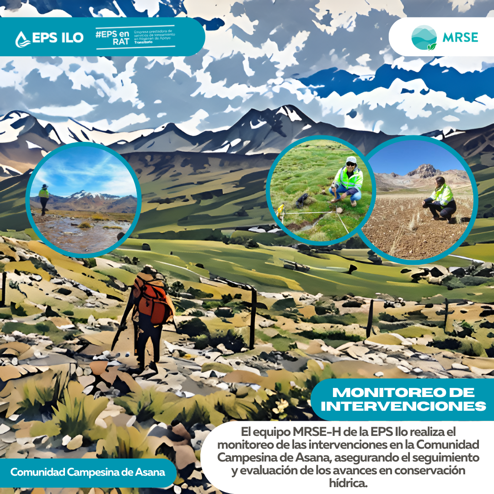

.onunload%20=%20function()%7Bwindow.history.back();%7D))

### Monitoreo de intervenciones

Durante el mes de marzo, el equipo técnico del MRSE de la EPS Ilo realizó visitas de campo en la Comunidad de Asana para verificar el estado de las intervenciones implementadas y la operatividad de los equipos de monitoreo. Estas actividades permitieron evaluar los efectos de la temporada de lluvias y asegurar la continuidad del monitoreo hidrológico.
