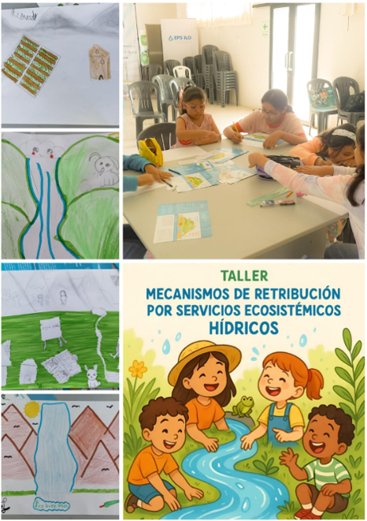

.onunload%20=%20function()%7Bwindow.history.back();%7D))

### I Taller Educativo Piloto dirigido a niños y niñas

El 12 de abril se llevó a cabo el I Taller Educativo sobre MRSE dirigido a niños y niñas, como parte de las acciones de sensibilización y fortalecimiento de capacidades impulsadas por la EPS Ilo. El objetivo fue introducir conceptos básicos sobre cuencas, servicios ecosistémicos y conservación.

La jornada incluyó el concurso de dibujo **"Así veo mi cuenca"**, donde los participantes plasmaron de forma creativa su comprensión sobre el entorno natural, reflejando una alta capacidad de observación e intuición ecológica.
