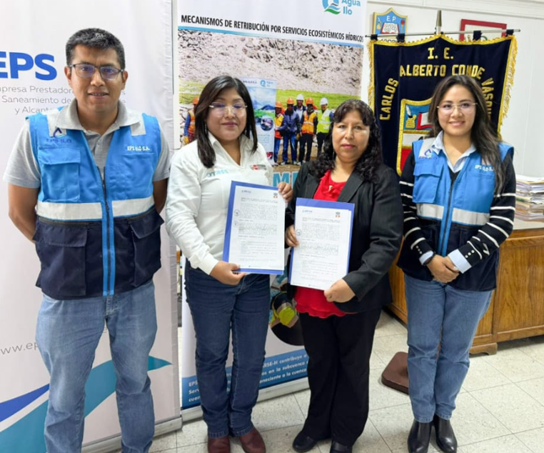

.onunload%20=%20function()%7Bwindow.history.back();%7D))

### EPS Ilo firma convenio con institución educativa para llevar el I Taller Piloto de aprendizaje sobre los MRSE en I.E. de nivel primario

La EPS Ilo firmó un convenio con la I.E. Carlos Alberto Conde Vásquez para desarrollar un innovador taller educativo sobre MRSE-H dirigido a estudiantes de 5to grado. Esta alianza promueve la educación ambiental desde edades tempranas mediante dinámicas participativas.

El taller consta de cuatro sesiones que abordan temas clave como cuencas, contribuyentes y monitoreo hidrológico, y se ejecutará durante el mes de junio con el acompañamiento del equipo técnico del MRSE.
