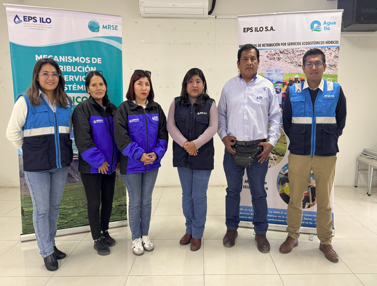

.onunload%20=%20function()%7Bwindow.history.back();%7D))

El 10 de junio, la EPS Ilo presentó su propuesta de monitoreo hidrológico en la microcuenca Asana durante una reunión técnica con EPS Moquegua. Esta propuesta, construida en campo junto a la comunidad, busca articular esfuerzos para fortalecer la red de monitoreo.

EPS Ilo lideró esta iniciativa desde su experiencia con enfoque territorial y participativo. Como resultado, ambas EPS acordaron avanzar hacia un sistema colaborativo que garantice una gestión integrada y sostenible del recurso hídrico.
