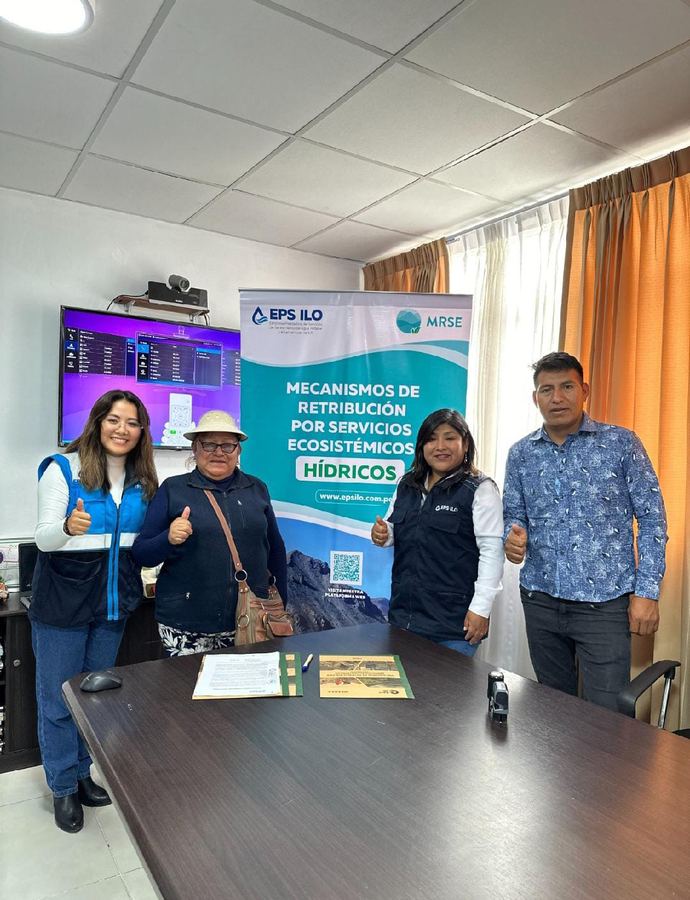

.onunload%20=%20function()%7Bwindow.history.back();%7D))

### EPS Ilo y Comunidad Campesina de Asana reafirman el Acuerdo MRSE para seguir trabajando por la conservación y recuperación de los Servicios Ecosistémicos

La EPS Ilo y la Comunidad Campesina de Asana renovaron su compromiso con la conservación de los ecosistemas hídricos mediante la firma de un nuevo acuerdo institucional. Se presentaron resultados del periodo 2022--2024 y se reafirmó el uso y mantenimiento de las intervenciones ejecutadas.

El acta fue suscrita por ambas partes, destacando la voluntad comunal de continuar colaborando activamente en las acciones del MRSE, lo cual refuerza un modelo de gestión participativa y sostenible del recurso hídrico.
