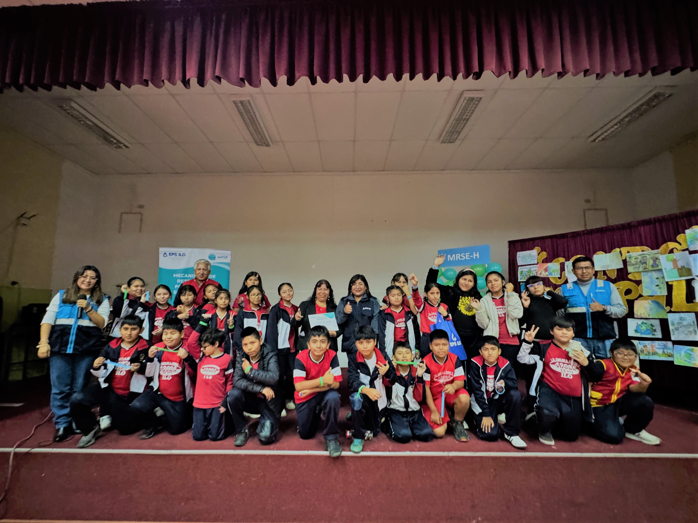

.onunload%20=%20function()%7Bwindow.history.back();%7D))

### Clausura del I Taller Piloto de aprendizaje sobre los MRSE en I.E. de nivel primario

Con gran éxito se clausuró el primer taller educativo piloto sobre MRSE-H, desarrollado por EPS Ilo en coordinación con la I.E. Carlos Alberto Conde Vásquez. Participaron 86 estudiantes de primaria, quienes exploraron temas sobre agua, naturaleza y sostenibilidad.

La clausura incluyó un concurso de dibujo escolar y la participación activa de docentes y autoridades. EPS Ilo reafirma su compromiso con la educación ambiental y la formación de una nueva generación consciente del valor del agua.

*Enterate más en las siguientes notas:*

-   [Prensa Regional](https://tinyurl.com/mrynhnxx)

-   <https://tinyurl.com/awt3aw9d>

-   [FB Ilo Peru](https://tinyurl.com/ys3kt5u2)

-   [Gaviota Noticias](https://tinyurl.com/5n7yccpy)

-   [Telesur Radio Expresión](https://tinyurl.com/37anrs4f)

-   [El Puerto Noticias](https://tinyurl.com/mr3842cx)
