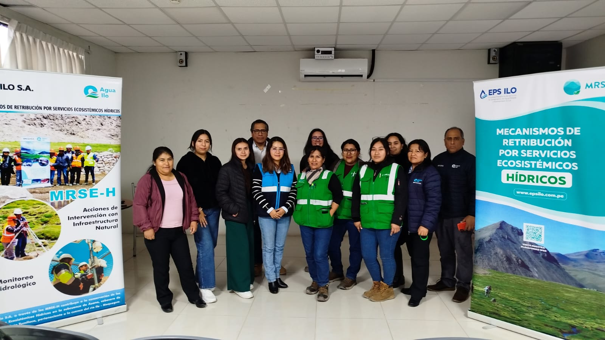

.onunload%20=%20function()%7Bwindow.history.back();%7D))

### EPS Ilo fortalece capacidades internas con II Taller sobre MRSE-H

Ilo, julio de 2025. En el marco del proceso de sensibilización y fortalecimiento institucional, la EPS Ilo S.A. llevó a cabo el II Taller Interno sobre los Mecanismos de Retribución por Servicios Ecosistémicos Hídricos (MRSE-H), dirigido al personal técnico, administrativo y de prácticas preprofesionales de las distintas gerencias.

El taller se realizó el 25 de julio en la Sala de Usos Múltiples de la EPS y tuvo como objetivo reforzar el conocimiento sobre la implementación de los MRSE-H, los avances del piloto educativo en instituciones educativas de la provincia y el enfoque de infraestructura natural y siembra y cosecha de agua en zonas altoandinas.

La jornada incluyó una presentación participativa a cargo del equipo técnico del MRSE-H, así como dinámicas grupales orientadas a generar reflexión sobre el rol institucional en la conservación de fuentes hídricas.

La actividad fue gestionada por el equipo técnico del MRSE-H, con el apoyo de la Oficina de Comunicaciones de la EPS Ilo, reafirmando el compromiso institucional con la sostenibilidad y la educación ambiental.
